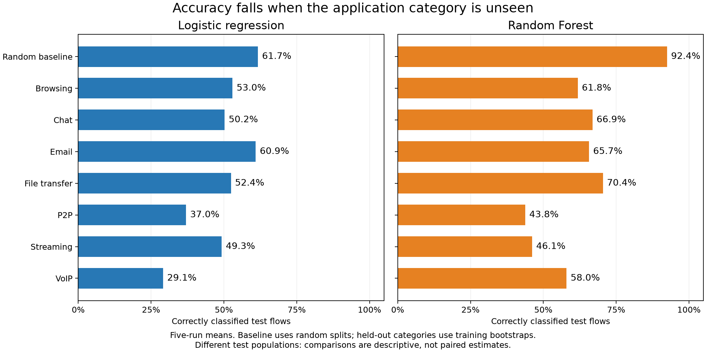
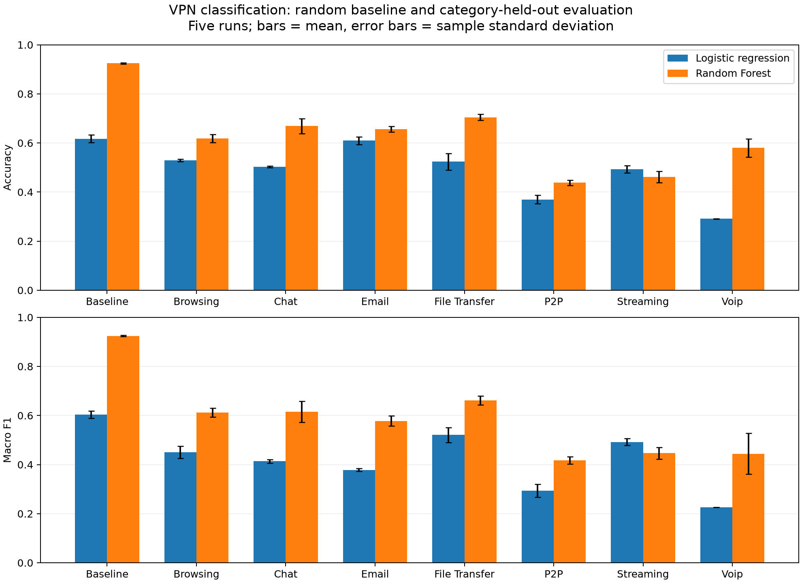
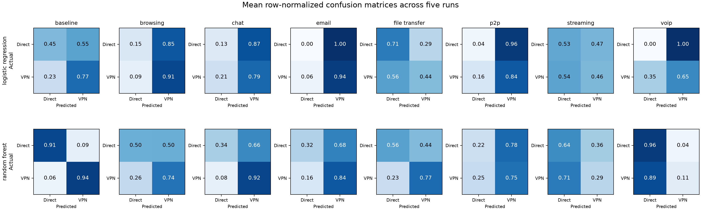

# VPN results: visual overview

## Accuracy at a glance

Random Forest scores **92.4%** on the random baseline but **43.8–70.4%** when an
application category is left out. The bars below show the exact five-run means.

[Download the PDF](accuracy_overview.pdf).

## Accuracy, balanced performance, and run variation

Accuracy counts all correct predictions. Macro-F1 gives each class equal weight,
helping reveal failures that accuracy can hide. Short black error bars show
standard deviation across the five runs; they are not session-level confidence
intervals. Baseline runs vary the random split; LOAO runs resample training flows
while keeping the held-out test category fixed.

[Download the PDF](comparison.pdf).

## Which traffic gets misclassified?

Rows show the actual class; columns show the prediction. Each row sums to 1.
For example, 0.89 in the VPN row and Direct column means 89% of actual VPN flows
were mistaken for direct traffic. Dark diagonal cells indicate correct predictions.

[Download the PDF](confusion_matrices.pdf).

Random Forest's VoIP result illustrates why both metrics matter: its average
accuracy is 58.0%, but it correctly identifies only 11.0% of VPN flows.

All figures use the deduplicated VPN study. Different categories have different
test populations and class balances; these comparisons do not isolate the cause
of performance drops. They do not establish session or temporal generalization.

See [the findings](findings.md) and [readable numbers](summary_readable.md).
Regenerate these graphics with `.venv/bin/python plot_study.py`.
